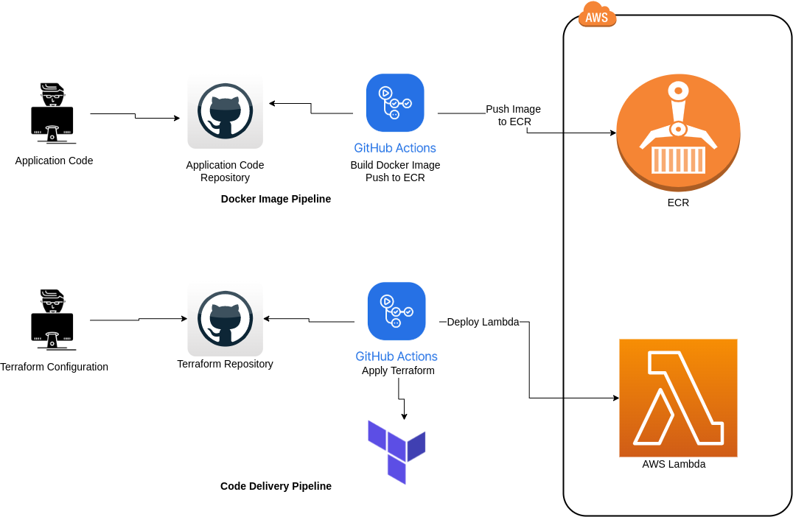

# Terraform AWS Lambda

This repository contains Terraform configuration file to deploy AWS Lambda function using GitHub Action.

- `main.tf` file contains base Terraform configuration file.
- `terraform_modules` folder contains terraform modules for lambda function.
- `.github/workflows` folder contains GitHub Action workflow file to deploy lamda function.

## Dependencies

This Repository is dependent on [aws_lambda_cicd](https://github.com/adityarajttn/aws_lambda_cicd). Once docker image is build the only deploy the lambda function. 


## Authenticating to AWS

Set the Acess key and secret key in the GitHub Action secrets with key as following.
```
AWS_ACCESS_KEY_ID:  ATDJKSSCXHGSJAXXXX
AWS_SECRET_ACCESS_KEY: 678ygshGD765rhsbvdwdhsg87
```

## Quick start

1. Go to Actions section.
2. Click on `Run workflow`
3. Input the values as per your need.
4. Run the workflow.

## Workflow Diagram


